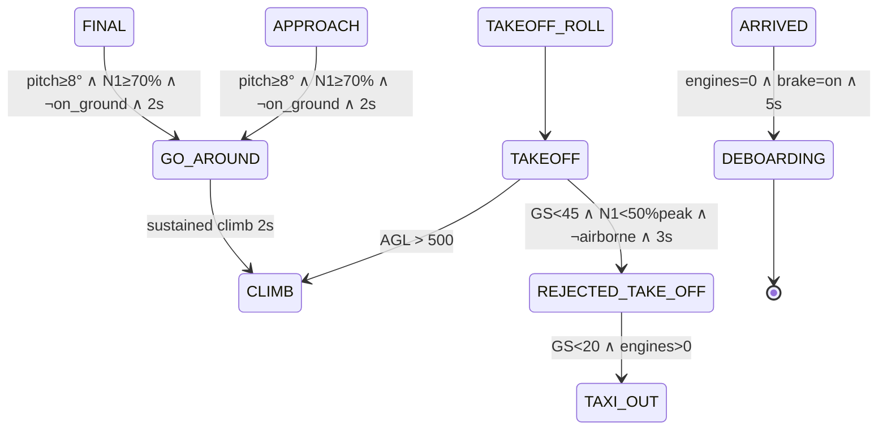

# v0.9.0 — Erweiterte Flight-Phases: RTO, Go-Around, Deboarding

**Status:** PROPOSAL — bereit fuer Implementation nach v0.8.4
**Datum:** 2026-05-18
**Quelle:** Stratos v2.14.0 FSM-Analyse (17 Phasen) + AeroACARS-Owner-Wunschliste (PIREP-Aussagekraft)
**Ziel:** AeroACARS-FSM bekommt drei neue terminale bzw. ueberbrueckende Phasen — `REJECTED_TAKE_OFF`, `GO_AROUND`, `DEBOARDING` — damit Sondersituationen (Startabbruch, Durchstarten, Endgueltiges Abstellen) explizit im Phase-Stream sichtbar werden statt unter generischen Phasen versteckt zu laufen. Keine FSM-Neuarchitektur, nur additive Erweiterung.

## Kurzfassung

Heute hat AeroACARS 17 interne `FlightPhase`-Varianten (`Preflight, Boarding, Pushback, TaxiOut, TakeoffRoll, Takeoff, Climb, Cruise, Holding, Descent, Approach, Final, Landing, TaxiIn, BlocksOn, Arrived, PirepSubmitted`). Drei davon spiegeln Sonderfaelle aber NICHT explizit wider:

1. **Startabbruch (RTO)** — Pilot rollt mit voller Power, bricht ab, rollt zurueck zum Gate. FSM bleibt in `TakeoffRoll`/`Takeoff` haengen und wechselt erst beim langsamen Roll-Back wieder zu `TaxiOut`. Es gibt keinen einzelnen Sample der „dieser Flug hatte einen RTO" sagt.
2. **Durchstarten (Go-Around)** — Internal wird der GA in `check_go_around()` erkannt (`stats.go_around_count` bumpt, ein Acars-Log-Eintrag entsteht) und die Phase wechselt zurueck zu `Climb`. Fuer den Webapp-Phase-Stream und MQTT-Konsumenten ist der GA-Moment aber unsichtbar: sie sehen nur `APPROACH → CLIMB`, ohne den Zwischenzustand.
3. **Deboarding** — Sobald der Flug eingereicht (`PirepSubmitted`) oder als `Arrived` markiert ist, gibt es keinen weiteren Phase-Event mehr — auch wenn der Pilot noch 5 Minuten Engines runterfaehrt, GPU anschliesst, Doors oeffnet. Stratos hat dafuer explizit `DEBOARDING` als finale Phase.

v0.9.0 fuegt diese drei Phasen als gleichberechtigte FSM-Knoten hinzu. Die bestehenden Transitions bleiben unveraendert; die neuen Phasen sitzen an klar definierten Stellen (RTO-Branch aus `Takeoff`, GA-Branch aus `Approach`/`Final`, Deboarding-Branch aus `Arrived`). Stratos-Schwellen werden 1:1 uebernommen (45 kt, 50 % N1-Drop, 8° Pitch, 70 % N1). Hysterese (2–3 s Dwell) verhindert Sample-Glitches. PIREP-Notes bekommen bei RTO/GA einen Auto-Append mit Kontext (Airport, Runway, Speed, AGL).

Out of scope fuer v0.9.0 (separate Specs): weitere Stratos-Phasen wie `ARRIVED` als eigene Stratos-Lesart (wir haben sie schon), Multi-Leg-Tracking, Helikopter-spezifische Phasen, Phase-Replay-Mode fuer Coach-Sessions.

## Problem

### Pilot-Story 1: RTO bei niedriger Geschwindigkeit

**Szenario:** Pilot Michael, LIRF RWY 16L, B738. Power-Set auf 92 % N1, Roll beginnt. Bei 38 kt sieht er einen Vogelschwarm vor sich und reisst die Thrustlevers auf IDLE + Reverse. Aircraft bremst, kommt bei 12 kt zum Stillstand, Pilot rollt langsam zurueck zum Holding-Point.

**Was AeroACARS heute zeigt:**

```
14:23:11  TAXI_OUT       → TAKEOFF_ROLL    (GS 28 kt, N1 87 %)
14:23:14  TAKEOFF_ROLL   → TAKEOFF         (GS 45 kt — falsch, Pilot war schon am Abbrechen)
14:23:18  TAKEOFF        → TAKEOFF         (GS 12 kt, on_ground=true — FSM bleibt)
14:23:45  TAKEOFF        → TAXI_OUT        (GS 8 kt, slow roll — Re-Klassifikation)
```

Der Pilot war NIE im echten Takeoff. Es war ein klassischer RTO. Webapp-Live-Map zeigt aber „TAKEOFF" fuer 30 s und springt dann zurueck zu „TAXI_OUT" ohne Begruendung. PIREP-Notes enthalten nichts ueber den Abbruch. Discord-RPC zeigt 30 s lang „in Departure" — peinlich falsch.

### Pilot-Story 2: Go-Around aus APPROACH

**Szenario:** Pilot Lisa, EDDM RWY 26R, A320. ILS-Final stabilisiert auf 700 ft AGL. Bei 350 ft AGL sieht sie eine vorhergehende Maschine die die Bahn noch nicht verlassen hat, ATC ruft „Go around, climb maintain 4000". Sie schiebt TOGA, zieht auf 12° Pitch, klappt Flaps eins zurueck.

**Was AeroACARS heute zeigt:**

```
14:51:02  APPROACH       → FINAL           (AGL 680 ft)
14:51:18  FINAL          → FINAL           (AGL 350 ft, lowest)
14:51:23  FINAL          → CLIMB           (V/S +1800 fpm, GA confirmed)
14:51:23  [ACARS log] Go-around #1 at 412 ft AGL (V/S +1840 fpm)
```

Intern erkennt der `check_go_around()`-Check den Durchstart korrekt — aber der ZWISCHENZUSTAND fehlt komplett. Webapp-Phase-Pill springt von „FINAL" direkt zu „CLIMB" als waere es ein normaler Aufstieg. Discord-RPC, Pilot-Cockpit-Tab und Webapp-Live-Map sehen nicht den GA, sondern einen Klassen-A-Anomalie-Sprung den Konsumenten als Bug interpretieren („wieso ist der jetzt wieder im Climb obwohl er gerade landen wollte?"). Der `go_around_count`-Counter hilft, ist aber nirgends in der UI prominent.

### Pilot-Story 3: Deboarding-Limbo nach ARRIVED

**Szenario:** Pilot Tom, EHAM Gate B12, B738. Touchdown, Taxi-In, Parking-Brake setzen, Engines Shutdown.

**Was AeroACARS heute zeigt:**

```
15:42:01  TAXI_IN        → BLOCKS_ON       (parking_brake=true)
15:42:01  BLOCKS_ON      → ARRIVED         (engines_running=0, dwell met)
15:42:01  [PIREP filed]
15:42:01  ARRIVED        → PIREP_SUBMITTED
15:42:02–15:48:30   (5+ min)  PIREP_SUBMITTED  (nichts mehr)
```

Der Pilot ist 5 Minuten beschaeftigt: APU starten, GPU anschliessen, Cabin-Crew „Doors disarmed and cross-checked", Pax aussteigen, Cargo entladen. Diese Phase ist real und in Stratos explizit modelliert. Bei uns ist es unsichtbares Nirvana. Discord-RPC steht weiter auf „PIREP submitted" — eine Stunde lang wenn der Pilot vergisst die App zu schliessen. Webapp-Live-Map zeigt das Flugzeug als „idle" und Mitpiloten sehen nicht dass dort gerade aktiv deboarded wird.

### Strukturelle Ursache

- **FSM-Knoten-Granularitaet** — Drei reale Pilot-Aktivitaeten (RTO, GA, Deboarding) sind heute UNTER bestehenden Phasen versteckt oder fallen ganz aus dem Modell heraus.
- **Sichtbarkeit** — `go_around_count` ist nur ein Zaehler in `FlightStats`, kein Phase-Event. Konsumenten (MQTT, Webapp, Discord-RPC, PIREP-Notes) sehen ihn nicht als gleichberechtigte Phase.
- **PIREP-Aussagekraft** — Heute landet ein „aborted at 38 kt" nicht in den PIREP-Notes. Der VA-Owner kann nicht filtern „zeig mir alle Fluege mit RTO" — die Information ist nicht denormalisiert.

### Vergleich Stratos v2.14.0

Stratos (Open-Source-ACARS-Konkurrent, Java/Kotlin) hat 17 Phasen, sehr aehnlich zu unseren — aber explizit mit RTO/GA/Deboarding. Auszug aus deren `FlightPhase.kt`:

```
UNKNOWN, BOARDING, PUSH_BACK, TAXI, TAKE_OFF, REJECTED_TAKE_OFF,
CLIMB, CRUISE, DESCENT, APPROACH, FINAL, LANDED, GO_AROUND,
TAXI_IN, ARRIVED, DEBOARDING
```

Trigger-Konstanten (aus Stratos `FlightPhaseDetector`):

| Stratos-Konstante       | Wert       | Verwendung                                              |
| ----------------------- | ---------- | ------------------------------------------------------- |
| `TAKEOFF_SPEED`         | 45 kt      | Schwelle fuer TAKEOFF-Beginn                            |
| `RTO_POWER_DROP_PCT`    | 0.50 (50%) | N1 faellt auf < 50 % des Peak-N1 → RTO-Verdacht         |
| `RTO_MIN_DWELL_SECS`    | 3 s        | Mindest-Dwell bevor RTO bestaetigt wird                 |
| `GO_AROUND_PITCH`       | 8°         | Pitch ≥ 8° als Hinweis auf TOGA-Steigflug              |
| `GO_AROUND_N1`          | 70 %       | N1 ≥ 70 % nach Anflug-Idle → Vollgas erkannt           |
| `GO_AROUND_MIN_DWELL`   | 2 s        | Mindest-Dwell fuer GA-Bestaetigung                      |
| `DEBOARDING_ENGINES`    | 0          | Alle Engines aus                                        |
| `DEBOARDING_BRAKE`      | true       | Parking-Brake gesetzt                                   |
| `DEBOARDING_DWELL_SECS` | 5 s        | Min 5 s in Arrived + Engines-off + Brake an             |

Diese Werte uebernehmen wir 1:1 (siehe LE5).

## Leitentscheidungen

### LE1: Nur ERWEITERUNG, kein FSM-Rebuild

Die bestehenden 17 Phasen bleiben unveraendert. Die neuen drei Phasen werden als zusaetzliche Varianten in `enum FlightPhase` und neue Transitions in der bestehenden `match next_phase`-Kette hinzugefuegt. Kein Rename, kein Reorder, keine Semantik-Aenderung an bestehenden Phasen.

Begruendung: minimaler Blast-Radius. Backward-Compat fuer alte PIREPs, alte MQTT-Konsumenten, alte Webapp-Versionen. Die letzten Releases (v0.7.x → v0.8.x) haben gezeigt dass jede FSM-Aenderung Edge-Cases produziert — additive Erweiterung ist die robusteste Strategie.

### LE2: Phase-Strings exakt wie Stratos

Die neuen Wire-Strings sind `REJECTED_TAKE_OFF`, `GO_AROUND`, `DEBOARDING` — identisch zu Stratos. Nicht `RTO`, nicht `GA`, nicht `DEBOARD`. Lange Form, snake-upper.

Begruendung: zukuenftige Interoperabilitaet (z. B. Cross-VA-Phase-Streams), keine Notwendigkeit eine eigene Konvention zu erfinden. Konsistenz mit dem etablierten Open-Source-Vorbild. Unsere bestehenden Wire-Strings (`TAKEOFF_ROLL`, `BLOCKS_ON`) sind ohnehin schon snake-upper.

### LE3: Backward-Compat fuer alte Pilot-Clients

Ein Pilot der noch v0.8.4 laeuft kennt die neuen Strings nicht. Wenn er einen `GO_AROUND` ueber MQTT von einem v0.9.0-Konsumenten sieht (oder umgekehrt), darf das nicht crashen.

- Rust-Seite (`FlightPhase` enum) muss `#[serde(other)]` Fallback haben → Default → Preflight bei unbekanntem String.
- Webapp/Pilot-Client-i18n: bei fehlendem `phase.rejected_take_off`-Key Fallback auf den raw-string.
- Webapp Live-Map: unbekannte Phase wird als grau „?" gerendert.

Begruendung: Rolling-Update-Sicherheit. Wir koennen v0.9.0 deployen ohne dass v0.8.x-Piloten Fehler sehen.

### LE4: Recorder akzeptiert TEXT phase, KEINE Schema-Migration

`recorder/src/db.ts` speichert `phase TEXT` in `pilot_positions`, `flight_state`, `pireps`. Es gibt KEIN enum-CHECK-Constraint. Damit ist ein zusaetzlicher String-Wert sofort akzeptiert — kein `ALTER TABLE`, kein Migration-Script, kein Downtime.

Begruendung: SQLite ist permissiv-typed bei TEXT-Spalten. Wir haben das in v0.5.18 bereits genutzt als wir die `phase_label()`-Mappings expanded haben (Pre-v0.5.18 collapsed 5 → 1, v0.5.18+ alle 17 distinct — kein DB-Schema-Change noetig).

### LE5: Trigger-Schwellen 1:1 Stratos-Werte

Die Stratos-Schwellen (45 kt, 50 % N1-Drop, 8° Pitch, 70 % N1, 3 s/2 s/5 s Dwells) werden ohne Anpassung uebernommen. Sie sind aus mehreren tausend Stratos-PIREPs empirisch validiert.

Begruendung: Stratos ist ein lebendes Konkurrenz-Projekt mit aktiver Pilot-Base. Wenn deren Werte stabil funktionieren, ist eigene Tuning-Arbeit verschwendet. Bei Bedarf (= Pilot-Feedback) kann man die Werte spaeter pro VA konfigurierbar machen.

Konkret als Rust-Konstanten:

```rust
const RTO_SPEED_THRESHOLD_KT: f32 = 45.0;
const RTO_POWER_DROP_FACTOR: f32 = 0.50;
const RTO_DWELL_SECS: i64 = 3;
const GO_AROUND_PITCH_DEG: f32 = 8.0;
const GO_AROUND_N1_PCT: f32 = 70.0;
const GO_AROUND_DWELL_SECS: i64 = 2;
const DEBOARDING_DWELL_SECS: i64 = 5;
```

(Die bereits existierenden GA-Konstanten `GO_AROUND_AGL_RECOVERY_FT`, `GO_AROUND_MIN_VS_FPM`, `GO_AROUND_DWELL_SECS` bleiben — sie bedienen die heutige reine V/S-basierte GA-Erkennung. v0.9.0 erweitert um Pitch + N1.)

### LE6: Hysterese ueber Dwell-Timer

Jede der drei neuen Transitions braucht einen Dwell-Timer (RTO 3 s, GA 2 s, Deboarding 5 s). Ein einzelner Tick mit z. B. „N1 ist auf 48 % gefallen" reicht NICHT — der Pilot koennte einfach kurz Power zuruecknehmen um eine Bahnkruemmung zu navigieren.

Implementation analog zum bestehenden `go_around_climb_pending_since: Option<DateTime<Utc>>`-Pattern in `FlightStats`. Drei neue Felder:

```rust
rto_pending_since: Option<DateTime<Utc>>,
go_around_powered_pending_since: Option<DateTime<Utc>>,
deboarding_pending_since: Option<DateTime<Utc>>,
```

Bei jedem Tick wird `get_or_insert(now)` aufgerufen wenn die Trigger-Bedingung erfuellt ist; wenn `now - pending >= DWELL_SECS`, wird die Phase gewechselt und das Feld auf `None` zurueckgesetzt. Wenn die Bedingung bricht, wird das Feld auch auf `None` gesetzt (Dwell-Reset).

Begruendung: das ist die im Code etablierte Hysterese-Pattern (siehe `check_go_around()`, `check_holding_entry()`, `check_descent_transition()`). Konsistenz ist wichtiger als Erfindung.

### LE7: PIREP-Notes Auto-Append bei RTO/GA

Bei jeder bestaetigten RTO-/GA-Transition wird ein menschen-lesbarer Eintrag in `stats.pending_acars_logs` geschrieben (analog zum heutigen „Go-around #N at ..."). Beim PIREP-Filing wird dieser Log in die `pirep.notes` als kompakter Sondereintrag uebernommen.

Format-Beispiele:

```
RTO at LIRF 16L · aborted at 38 kt · peak N1 92% → 38%
GO_AROUND from APPROACH · 412 ft AGL · executed missed approach
DEBOARDING at EHAM B12 · 5 min after blocks
```

Begruendung: VA-Owner kann via grep/SQL-LIKE in den PIREP-Notes nach „RTO at " filtern und alle Startabbrueche zaehlen. Das ist die einfachste Audit-Mechanik ohne zusaetzliche DB-Spalten.

### LE8: Webapp Phase-Farben — Warn fuer RTO/GA, Muted fuer Deboarding

| Phase                | Farb-Token              | Hex (Dark-Mode) | Begruendung                          |
| -------------------- | ----------------------- | --------------- | ------------------------------------ |
| `REJECTED_TAKE_OFF`  | `--color-warn-strong`   | `#dc2626`       | rot — Sicherheitsereignis           |
| `GO_AROUND`          | `--color-warn-medium`   | `#f59e0b`       | amber — Anomalie, aber kontrolliert |
| `DEBOARDING`         | `--color-muted`         | `#6b7280`       | grau — terminal, keine Aktion mehr  |

Pilot-Client uebernimmt die gleichen Token (mit Light-Mode-Anpassung). Phase-Pill bekommt einen leichten Pulse-Animation-Effekt bei RTO/GA waehrend die Phase aktiv ist (max. 5 s), damit der Pilot sieht „hier ist gerade was passiert".

Begruendung: visuelle Sprache muss Sicherheits-Relevanz spiegeln. Heute haben alle Phasen die gleiche neutrale Farbe — RTO/GA verdienen eine sichtbare Sonderbehandlung.

## FSM-Erweiterung

### ASCII-Diagramm (nur die neuen Branches)

```
                    ┌───────────────┐
                    │   TAXI_OUT    │
                    └───────┬───────┘
                            │  (GS ≥ takeoff_roll_speed)
                            ▼
                   ┌────────────────┐
                   │  TAKEOFF_ROLL  │◄─────────────────┐
                   └───────┬────────┘                  │
                           │  (GS ≥ 45 kt, AGL < 50)   │ slow-roll back
                           ▼                           │ (RTO recovery)
                   ┌────────────────┐                  │
                   │    TAKEOFF     │◄───────┐         │
                   └───────┬────────┘        │         │
                           │                 │         │
              ┌────────────┼────────────┐    │         │
              │            │            │    │         │
              │ (AGL > 500)│            │    │         │
              │            │  (RTO trigger: GS<45      │
              │            │   AND N1 < 50% peak       │
              │            │   AND !airborne           │
              │            │   AND dwell ≥ 3s)         │
              │            │            │    │         │
              ▼            │            ▼    │         │
       ┌──────────┐        │  ┌────────────────────┐  │
       │  CLIMB   │        │  │ REJECTED_TAKE_OFF  │──┘
       └────┬─────┘        │  └────────────────────┘
            │              │
            │              │  ┌────────────────────────┐
            │              └─►│  (heutiger Pfad bleibt)│
            │                 └────────────────────────┘
            ▼
       ┌──────────┐
       │  CRUISE  │
       └────┬─────┘
            ▼
       ┌──────────┐
       │ DESCENT  │
       └────┬─────┘
            ▼
       ┌──────────┐
       │ APPROACH │◄────────────────────┐
       └────┬─────┘                     │
            │ (AGL < 700)               │
            ▼                           │
       ┌──────────┐                     │
       │  FINAL   │                     │
       └────┬─────┘                     │
            │                           │
   ┌────────┼──────────┐                │
   │        │          │                │
   │  (on_ground)      │  (GA trigger: pitch ≥ 8°
   │        │          │   AND N1 ≥ 70%
   │        │          │   AND !on_ground
   │        │          │   AND dwell ≥ 2s)
   │        │          │                │
   │        │          ▼                │
   │        │   ┌───────────────┐       │
   │        │   │   GO_AROUND   │───────┘ (after 2s sustained
   │        │   └───────┬───────┘          climb → reverts to CLIMB)
   │        │           │
   │        │           ▼
   │        │     ┌──────────┐
   │        │     │  CLIMB   │
   │        │     └──────────┘
   │        ▼
   │   ┌──────────┐
   │   │ LANDING  │
   │   └────┬─────┘
   │        ▼
   │   ┌──────────┐
   │   │ TAXI_IN  │
   │   └────┬─────┘
   │        ▼
   │   ┌──────────┐
   │   │ BLOCKS_ON│
   │   └────┬─────┘
   │        ▼
   │   ┌──────────┐
   │   │ ARRIVED  │
   │   └────┬─────┘
   │        │ (engines=0 AND brake=true
   │        │  AND dwell ≥ 5s)
   │        ▼
   │   ┌────────────┐
   │   │ DEBOARDING │  (terminal — kein Self-Loop, kein
   │   └────────────┘   weiterer Phase-Wechsel mehr)
   ▼
   ...
```

### Mermaid-Variante



## Datenmodell

### Rust — `sim-core/src/lib.rs`

```rust
#[derive(Debug, Clone, Copy, Default, Serialize, Deserialize, PartialEq, Eq)]
pub enum FlightPhase {
    #[default]
    Preflight,
    Boarding,
    Pushback,
    TaxiOut,
    TakeoffRoll,
    Takeoff,
    RejectedTakeOff,   // NEU — v0.9.0
    Climb,
    Cruise,
    Holding,
    Descent,
    Approach,
    Final,
    GoAround,          // NEU — v0.9.0
    Landing,
    TaxiIn,
    BlocksOn,
    Arrived,
    Deboarding,        // NEU — v0.9.0
    PirepSubmitted,
}
```

### Rust — `FlightStats` Erweiterung (`client/src-tauri/src/lib.rs`)

```rust
struct FlightStats {
    // ... bestehende Felder ...
    
    // v0.9.0 — RTO-Detection
    takeoff_n1_peak_pct: Option<f32>,         // Peak N1 waehrend TAKEOFF_ROLL/TAKEOFF
    rto_pending_since: Option<DateTime<Utc>>, // Dwell-Timer fuer RTO-Bestaetigung
    rto_count: u32,                           // Anzahl RTOs in diesem Flug (sollte 0 oder 1 sein)
    
    // v0.9.0 — Powered Go-Around (erweitert die V/S-basierte Detection)
    go_around_powered_pending_since: Option<DateTime<Utc>>,
    
    // v0.9.0 — Deboarding
    deboarding_pending_since: Option<DateTime<Utc>>,
}
```

`go_around_count` und das bestehende `go_around_climb_pending_since` bleiben unveraendert — der neue Pitch/N1-Trigger ist ein ZUSAETZLICHER, fruehzeitiger Detection-Pfad.

### Wire-Format — MQTT-`phase_label()` (`aeroacars-mqtt/src/lib.rs`)

```rust
fn phase_label(p: FlightPhase) -> &'static str {
    match p {
        FlightPhase::Preflight       => "PREFLIGHT",
        FlightPhase::Boarding        => "BOARDING",
        FlightPhase::Pushback        => "PUSHBACK",
        FlightPhase::TaxiOut         => "TAXI_OUT",
        FlightPhase::TakeoffRoll     => "TAKEOFF_ROLL",
        FlightPhase::Takeoff         => "TAKEOFF",
        FlightPhase::RejectedTakeOff => "REJECTED_TAKE_OFF",  // NEU
        FlightPhase::Climb           => "CLIMB",
        FlightPhase::Cruise          => "CRUISE",
        FlightPhase::Holding         => "HOLDING",
        FlightPhase::Descent         => "DESCENT",
        FlightPhase::Approach        => "APPROACH",
        FlightPhase::Final           => "FINAL",
        FlightPhase::GoAround        => "GO_AROUND",          // NEU
        FlightPhase::Landing         => "LANDING",
        FlightPhase::TaxiIn          => "TAXI_IN",
        FlightPhase::BlocksOn        => "BLOCKS_ON",
        FlightPhase::Arrived         => "ARRIVED",
        FlightPhase::Deboarding      => "DEBOARDING",         // NEU
        FlightPhase::PirepSubmitted  => "PIREP_SUBMITTED",
    }
}
```

### TypeScript — `client/src/types.ts` und `webapp/src/types.ts`

```ts
export type FlightPhaseString =
  | "PREFLIGHT" | "BOARDING" | "PUSHBACK" | "TAXI_OUT"
  | "TAKEOFF_ROLL" | "TAKEOFF" | "REJECTED_TAKE_OFF"
  | "CLIMB" | "CRUISE" | "HOLDING" | "DESCENT"
  | "APPROACH" | "FINAL" | "GO_AROUND"
  | "LANDING" | "TAXI_IN" | "BLOCKS_ON" | "ARRIVED"
  | "DEBOARDING" | "PIREP_SUBMITTED";
```

### DB-Schema — KEINE Aenderung

Recorder (`aeroacars-live/recorder/src/db.ts`):

```sql
CREATE TABLE pilot_positions (
    ...
    phase TEXT NOT NULL,   -- bleibt TEXT, akzeptiert jeden String
    ...
);
```

Pilot-Client lokale SQLite (`client/src-tauri/crates/storage/src/lib.rs`):

```rust
phase TEXT NOT NULL  // ebenfalls TEXT, kein enum-Constraint
```

Keine `ALTER TABLE`-Migrations, kein Default-Backfill noetig — alte Rows haben weiterhin ihre alten Phase-Strings, neue Rows duerfen die neuen Strings haben.

## Trigger-Implementation

### Stelle 1: RTO-Detection nach TAKEOFF_ROLL / TAKEOFF

Datei: `client/src-tauri/src/lib.rs`, im `match prev_phase`-Block der Streamer-Tick-FSM.

Neue Helper-Funktion (analog zu `check_go_around`):

```rust
/// v0.9.0: Rejected-Take-Off detection. Triggers when N1 drops to
/// <50% of the peak we saw during the takeoff roll AND ground speed
/// falls below 45 kt AND we never lifted off. Requires 3 s dwell to
/// avoid sample-glitches from brief power adjustments.
///
/// Returns `Some(FlightPhase::RejectedTakeOff)` once confirmed.
fn check_rto(
    stats: &mut FlightStats,
    snap: &SimSnapshot,
    now: DateTime<Utc>,
) -> Option<FlightPhase> {
    let peak = stats.takeoff_n1_peak_pct?;
    if peak < 70.0 {
        // Never reached real takeoff power → not an RTO scenario,
        // probably an aborted lineup or low-power taxi check.
        return None;
    }
    
    let current_n1 = snap.engine_n1_pct.unwrap_or(0.0);
    let conds = snap.ground_speed_kt < RTO_SPEED_THRESHOLD_KT
        && current_n1 < peak * RTO_POWER_DROP_FACTOR
        && snap.on_ground
        && snap.altitude_agl_ft < 50.0;
    
    if conds {
        let pending = stats.rto_pending_since.get_or_insert(now);
        if (now - *pending).num_seconds() >= RTO_DWELL_SECS {
            stats.rto_count = stats.rto_count.saturating_add(1);
            let speed_at_abort = snap.ground_speed_kt;
            let airport = stats.departure_icao.as_deref().unwrap_or("UNKNOWN");
            let runway = stats.takeoff_runway.as_deref().unwrap_or("??");
            stats.pending_acars_logs.push(format!(
                "RTO at {} {} · aborted at {:.0} kt · peak N1 {:.0}% → {:.0}%",
                airport, runway, speed_at_abort, peak, current_n1
            ));
            stats.rto_pending_since = None;
            return Some(FlightPhase::RejectedTakeOff);
        }
    } else {
        stats.rto_pending_since = None;
    }
    None
}
```

Integration in den Phase-Loop:

```rust
FlightPhase::TakeoffRoll => {
    // Track peak N1 fuer spaetere RTO-Detection
    if let Some(n1) = snap.engine_n1_pct {
        let prev = stats.takeoff_n1_peak_pct.unwrap_or(0.0);
        if n1 > prev {
            stats.takeoff_n1_peak_pct = Some(n1);
        }
    }
    
    if let Some(rto) = check_rto(&mut stats, snap, now) {
        next_phase = rto;
    } else if /* bestehender TAKEOFF-Trigger */ {
        next_phase = FlightPhase::Takeoff;
    }
}
FlightPhase::Takeoff => {
    // gleiche Peak-Tracking-Logik
    if let Some(n1) = snap.engine_n1_pct {
        let prev = stats.takeoff_n1_peak_pct.unwrap_or(0.0);
        if n1 > prev {
            stats.takeoff_n1_peak_pct = Some(n1);
        }
    }
    
    if let Some(rto) = check_rto(&mut stats, snap, now) {
        next_phase = rto;
    } else if snap.altitude_agl_ft > 500.0 {
        next_phase = FlightPhase::Climb;
        stats.climb_peak_msl = None;
    }
}
FlightPhase::RejectedTakeOff => {
    // Recovery → TAXI_OUT wenn Roll-Speed unter 20 kt UND Engines weiterlaufen
    // (= Pilot rollt zurueck zum Gate / Holding-Point).
    if snap.ground_speed_kt < 20.0 && snap.engines_running > 0 {
        next_phase = FlightPhase::TaxiOut;
        // Peak resetten damit ein evtl. zweiter Startversuch sauber
        // erkannt wird.
        stats.takeoff_n1_peak_pct = None;
    }
    // Sonst: Verbleibt in RTO. Wenn Engines aus → BLOCKS_ON/ARRIVED-Pfad
    // ueber bestehende Logik (RTO ist nicht terminal).
}
```

### Stelle 2: Powered Go-Around aus APPROACH / FINAL

Heutige `check_go_around()` rein V/S-basiert wird beibehalten. Zusaetzlicher FRUEHER Trigger ueber Pitch + N1:

```rust
/// v0.9.0: Powered Go-Around detection. Catches the moment the pilot
/// commits to a missed approach (TOGA + pitch up) BEFORE the V/S-based
/// detection waits for sustained climb. Triggers in APPROACH/FINAL when
/// pitch ≥ 8° AND N1 ≥ 70% AND not on ground, sustained 2 s.
///
/// Returns `Some(FlightPhase::GoAround)` once confirmed. The existing
/// V/S-based check_go_around() then converts GO_AROUND → CLIMB once
/// sustained climb is observed.
fn check_powered_go_around(
    stats: &mut FlightStats,
    snap: &SimSnapshot,
    now: DateTime<Utc>,
) -> Option<FlightPhase> {
    let pitch = snap.pitch_deg as f32;
    let n1 = snap.engine_n1_pct.unwrap_or(0.0);
    
    let conds = pitch >= GO_AROUND_PITCH_DEG
        && n1 >= GO_AROUND_N1_PCT
        && !snap.on_ground
        && snap.engines_running > 0;
    
    if conds {
        let pending = stats.go_around_powered_pending_since.get_or_insert(now);
        if (now - *pending).num_seconds() >= GO_AROUND_DWELL_SECS {
            stats.go_around_count = stats.go_around_count.saturating_add(1);
            let agl = snap.altitude_agl_ft as f32;
            let from_phase = if matches!(stats.phase, FlightPhase::Final) {
                "FINAL"
            } else {
                "APPROACH"
            };
            stats.pending_acars_logs.push(format!(
                "GO_AROUND from {} · {:.0} ft AGL · pitch {:.1}° · N1 {:.0}%",
                from_phase, agl, pitch, n1
            ));
            stats.go_around_powered_pending_since = None;
            return Some(FlightPhase::GoAround);
        }
    } else {
        stats.go_around_powered_pending_since = None;
    }
    None
}
```

Integration:

```rust
FlightPhase::Approach => {
    push_approach_sample(&mut stats, snap);
    update_lowest_approach_agl(&mut stats, snap);
    
    // PMDG-Capture (bestehend)
    if let Some(p) = &snap.pmdg { /* ... */ }
    
    // v0.9.0: Powered GA hat Vorrang vor V/S-basierter Detection
    if let Some(ga) = check_powered_go_around(&mut stats, snap, now) {
        next_phase = ga;
    } else if let Some(ga_phase) = check_go_around(&mut stats, snap, now) {
        next_phase = ga_phase;  // V/S-basiert → direkt CLIMB
    } else if snap.altitude_agl_ft < 700.0 {
        next_phase = FlightPhase::Final;
    } else if check_holding_entry(&mut stats, snap, now) {
        stats.previous_phase_before_holding = Some(FlightPhase::Approach);
        next_phase = FlightPhase::Holding;
    }
}
FlightPhase::Final => {
    push_approach_sample(&mut stats, snap);
    update_lowest_approach_agl(&mut stats, snap);
    
    if let Some(ga) = check_powered_go_around(&mut stats, snap, now) {
        next_phase = ga;
    } else if let Some(ga_phase) = check_go_around(&mut stats, snap, now) {
        next_phase = ga_phase;
    }
    if let Some(rw) = snap.selected_runway.as_ref().filter(|s| !s.is_empty()) {
        stats.approach_runway = Some(rw.clone());
    }
    if !was_on_ground && snap.on_ground {
        next_phase = FlightPhase::Landing;
        // (bestehender Touchdown-Anchor-Code bleibt)
    }
}
FlightPhase::GoAround => {
    // Sustained-Climb-Detection: wenn 2 s lang V/S > 500 fpm, wechsle zu CLIMB.
    // Wenn Pilot stattdessen wieder absinkt → zurueck zu APPROACH.
    if snap.vertical_speed_fpm > 500.0 && !snap.on_ground {
        let pending = stats.go_around_climb_pending_since.get_or_insert(now);
        if (now - *pending).num_seconds() >= GO_AROUND_DWELL_SECS {
            next_phase = FlightPhase::Climb;
            stats.climb_peak_msl = None;
            stats.lowest_agl_during_approach_ft = None;
            stats.go_around_climb_pending_since = None;
        }
    } else if snap.vertical_speed_fpm < -200.0 {
        // GA abgebrochen, Pilot sinkt wieder → zurueck zu APPROACH
        next_phase = FlightPhase::Approach;
        stats.go_around_climb_pending_since = None;
    } else {
        stats.go_around_climb_pending_since = None;
    }
}
```

### Stelle 3: Deboarding nach ARRIVED

```rust
FlightPhase::Arrived => {
    // bestehende Logik (PIREP-Filing, etc.) bleibt
    
    // v0.9.0: Deboarding-Trigger
    let conds = snap.engines_running == 0
        && snap.parking_brake_set
        && snap.on_ground;
    
    if conds {
        let pending = stats.deboarding_pending_since.get_or_insert(now);
        if (now - *pending).num_seconds() >= DEBOARDING_DWELL_SECS {
            next_phase = FlightPhase::Deboarding;
            let airport = stats.arrival_icao.as_deref().unwrap_or("UNKNOWN");
            let mins_since_arrived = stats.arrived_at
                .map(|t| (now - t).num_minutes())
                .unwrap_or(0);
            stats.pending_acars_logs.push(format!(
                "DEBOARDING at {} · {} min after blocks",
                airport, mins_since_arrived
            ));
            stats.deboarding_pending_since = None;
        }
    } else {
        stats.deboarding_pending_since = None;
    }
}
FlightPhase::Deboarding => {
    // Terminal phase — kein Self-Loop, kein weiterer Wechsel mehr.
    // PIREP-Submission kann hier weiter laufen falls noch nicht gefilt.
    // Wenn Pilot Engines wieder startet → zurueck zu ARRIVED (Auto-Recovery
    // fuer "ach doch nochmal kurz zum Hangar rollen").
    if snap.engines_running > 0 {
        next_phase = FlightPhase::Arrived;
    }
}
```

## i18n

### `client/src/locales/de/common.json`

```json
{
  "active_flight": {
    "phase": {
      "preflight": "Preflight",
      "boarding": "Boarding",
      "pushback": "Pushback",
      "taxi_out": "Taxi-Out",
      "takeoff_roll": "Takeoff Roll",
      "takeoff": "Takeoff",
      "rejected_take_off": "Startabbruch (RTO)",
      "climb": "Climb",
      "cruise": "Cruise",
      "holding": "Holding",
      "descent": "Descent",
      "approach": "Approach",
      "final": "Final",
      "go_around": "Durchstarten (Go-Around)",
      "landing": "Landing",
      "taxi_in": "Taxi-In",
      "blocks_on": "Blocks On",
      "arrived": "Arrived",
      "deboarding": "Deboarding",
      "pirep_submitted": "PIREP eingereicht"
    }
  }
}
```

### `client/src/locales/en/common.json`

```json
{
  "active_flight": {
    "phase": {
      "rejected_take_off": "Rejected Take-Off (RTO)",
      "go_around": "Go-Around",
      "deboarding": "Deboarding"
    }
  }
}
```

### `client/src/locales/it/common.json`

```json
{
  "active_flight": {
    "phase": {
      "rejected_take_off": "Decollo annullato (RTO)",
      "go_around": "Riattaccata (Go-Around)",
      "deboarding": "Sbarco"
    }
  }
}
```

### Discord-RPC-Strings

```rust
// client/src-tauri/src/lib.rs — phase_human_label()
match p {
    // ... bestehende ...
    FlightPhase::RejectedTakeOff => "RTO",
    FlightPhase::GoAround        => "Go-Around",
    FlightPhase::Deboarding      => "Deboarding",
}

// und im 3-letter-code-mapping fuer Discord-Aktivitaet:
FlightPhase::RejectedTakeOff => Some("RTO"),
FlightPhase::GoAround        => Some("GA"),
FlightPhase::Deboarding      => Some("DBG"),
```

## UI-Auswirkungen

### Pilot-Client Cockpit-Tab

- **Phase-Pill** im Header: zeigt aktuellen Phase-String. Farbe nach LE8 (RTO rot, GA amber, DEB grau). Bei RTO/GA leichter Pulse fuer max. 5 s nach Transition.
- **Activity-Log**: bei jeder Transition ein Eintrag `Phase: REJECTED_TAKE_OFF` mit Zeitstempel.
- **Phase-History-Strip** (optional, v0.9.x): horizontale Mini-Timeline der durchlaufenen Phasen unten am Cockpit-Tab — RTO/GA als rote/amber Marker hervorgehoben.

### Pilot-Client Landing-Tab

- Bei `go_around_count > 0` zeigt das LandingPanel eine Sondernotiz `Go-Around durchgefuehrt: 1` ueber dem Touchdown-Diagramm.
- Bei `rto_count > 0` (sollte nur 0/1 sein) erscheint ein Banner `Startabbruch in diesem Flug — siehe PIREP-Notes`.

### Webapp Live-Map

- Tooltip am Pilot-Marker zeigt neue Phase-Strings korrekt via i18n.
- Phase-Pill in der Marker-Card uebernimmt die LE8-Farben.
- Beim Polling-Refresh wird die Phase ohne Reload aktualisiert (bestehende Logik, kein Aenderungsbedarf).

### Webapp Pilot-History / PIREP-Detail

- PIREP-Card zeigt einen Sonderbadge:
  - `RTO` (rot) wenn `pirep.notes` einen `RTO at ...`-Eintrag enthaelt.
  - `Go-Around` (amber) wenn `pirep.notes` einen `GO_AROUND from ...`-Eintrag enthaelt.
- Filter-Dropdown im VA-Owner-Dashboard: „Nur RTO-Fluege zeigen" / „Nur Fluege mit Go-Around zeigen".
- PIREP-Detail-View blendet die Auto-Append-Notes in einer eigenen Sektion „Sondereinheit" hervor.

### Webapp Phase-Diagram

Falls die Webapp ein Phase-Timeline-Diagramm hat (heute optional pro PIREP): RTO/GA als farblich abgesetzte Segmente, Deboarding als ausgeblendetes Tail-Segment.

## PIREP-Notes-Auto-Append — Beispiele

```
[v0.9.0 phase-event] RTO at LIRF 16L · aborted at 38 kt · peak N1 92% → 38%
[v0.9.0 phase-event] GO_AROUND from FINAL · 412 ft AGL · pitch 11.2° · N1 87%
[v0.9.0 phase-event] GO_AROUND from APPROACH · 850 ft AGL · pitch 9.4° · N1 78%
[v0.9.0 phase-event] DEBOARDING at EHAM B12 · 4 min after blocks
```

Die `[v0.9.0 phase-event]`-Prefix ist optional aber empfohlen — macht das Audit-Grep einfacher und versions-spezifisch.

## REST-/MQTT-Wire-Konsequenzen

### MQTT — Live-Position-Topic

Bestehende Payload:

```json
{
  "pilot_id": 42,
  "lat": 41.8002,
  "lon": 12.2389,
  "phase": "TAKEOFF_ROLL",   // ← darf jetzt auch "REJECTED_TAKE_OFF" sein
  ...
}
```

Keine Schema-Aenderung. Server-Seite (`aeroacars-live/recorder`) speichert den String wie er kommt.

### REST — `/api/pirep/<id>`

```json
{
  "id": 12345,
  "current_phase": "DEBOARDING",   // ← neu moeglich
  "go_around_count": 1,            // bestehend, aber jetzt auch via Phase-Stream sichtbar
  "rto_count": 1,                  // NEU — v0.9.0
  "notes": "...\n[v0.9.0 phase-event] RTO at LIRF 16L · ...",
  ...
}
```

`rto_count` ist ein neues optionales JSON-Feld in der Pilot-Client-→-Recorder-PIREP-Submission. Recorder-Seite: `pireps.rto_count INTEGER DEFAULT 0` — additive Spalte, idempotent CREATE-OR-ALTER beim Recorder-Start.

(Anmerkung: Das ist die EINZIGE DB-Schema-Aenderung in v0.9.0 und sie ist optional. Wenn der VA-Owner keinen RTO-Filter braucht, kann man die Spalte weglassen — der RTO-Beleg lebt dann nur in `notes`.)

### Discord-RPC

Bestehende RPC-Activity-Update-Frequenz (10 s) bleibt. Neue Display-Strings:

| Phase                | Discord-Title-Suffix        | Discord-State        |
| -------------------- | --------------------------- | -------------------- |
| `REJECTED_TAKE_OFF`  | „AeroACARS — CALL ROUTE · RTO" | „Startabbruch"     |
| `GO_AROUND`          | „... · Go-Around"           | „Durchstarten"      |
| `DEBOARDING`         | „... · Deboarding"          | „Pax steigen aus"   |

## Akzeptanz-Kriterien

- **A1** — Manuell ausgeloester RTO-Replay (synthetischer Flight-Log: GS auf 38 kt + N1-Drop auf 38 %) triggert nach 3 s Dwell die Phase `REJECTED_TAKE_OFF`. PIREP-Notes enthalten einen `RTO at <ICAO> <RWY> · aborted at 38 kt · ...`-Eintrag.
- **A2** — Manuell ausgeloester Powered-GA-Replay (Pitch 11° + N1 82 % bei AGL 350 ft in FINAL) triggert nach 2 s Dwell `GO_AROUND`. Nach weiteren 2 s sustained V/S > 500 fpm wechselt FSM zu `CLIMB`. PIREP-Notes enthalten `GO_AROUND from FINAL · ...`.
- **A3** — Test-Flight bis Ende → `ARRIVED` → Engines aus → Parking-Brake an → nach 5 s Dwell Phase `DEBOARDING`. PIREP-Notes enthalten `DEBOARDING at <ICAO> · N min after blocks`. Discord-RPC zeigt „Deboarding".
- **A4** — Webapp + Pilot-Client zeigen die neuen Phasen mit korrektem i18n (DE/EN/IT), korrekten Farben (rot/amber/grau) und korrektem Pulse-Effekt bei RTO/GA fuer max. 5 s.
- **A5** — Ein bestehender PIREP aus v0.8.4 (alle Phasen aus dem alten Set) wird in v0.9.0-Webapp + Pilot-Client identisch wie vorher gerendert. Keine `?`-Pills, keine i18n-Fallback-Strings sichtbar.
- **A6** — Recorder-Seite: ein PIREP-Submission mit `current_phase: "DEBOARDING"` und `rto_count: 1` wird ohne Schema-Migration-Fehler akzeptiert; SQL-`SELECT * FROM pireps WHERE notes LIKE '%RTO at %'` liefert genau die RTO-Fluege.
- **A7** — Hysterese-Test: kurzer N1-Drop auf 45 % fuer 2 s (also unter dem 3-s-Dwell) triggert KEINE `REJECTED_TAKE_OFF`-Transition. Phase bleibt `TAKEOFF_ROLL`/`TAKEOFF`. Analog fuer GA-Pitch-Spike < 2 s und Engine-aus-Spike < 5 s.
- **A8** — End-to-End-Roundtrip: Pilot-Client sendet `phase: "GO_AROUND"` via MQTT → Recorder schreibt es in `pilot_positions.phase` → Webapp Live-Map polled `/api/pilots/active` → Pilot-Marker zeigt amber GO-AROUND-Pill mit korrektem i18n. Latenz < 10 s zwischen Pilot-Trigger und Webapp-Sichtbarkeit.

## Migrations-Notes

- **Keine DB-Schema-Migration** fuer `pilot_positions.phase`, `flight_state.phase` — diese sind bereits `TEXT NOT NULL` und akzeptieren beliebige Strings.
- **Optional** `pireps.rto_count INTEGER DEFAULT 0` — additive Spalte, idempotenter `ALTER TABLE pireps ADD COLUMN IF NOT EXISTS rto_count INTEGER NOT NULL DEFAULT 0` beim Recorder-Boot. Falls die Spalte schon existiert, no-op.
- **Pilot-Client lokale SQLite** — keine Migration. Lokales `phase TEXT`-Feld akzeptiert neue Strings.
- **Position-History** — keine Migration. Alte Rows behalten alte Phase-Strings; neue Rows duerfen die neuen Strings haben.
- **Cycle-Compat** — v0.8.4-Piloten und v0.9.0-Piloten koennen parallel laufen. v0.8.4-Webapp zeigt einen v0.9.0-Phase-String als raw-Uppercase-String (z. B. „REJECTED_TAKE_OFF") statt lokalisiertem Label — funktional ok, kosmetisch sichtbar bis Webapp upgradet.

## Tests / Fixtures

### Rust (sim-core + lib.rs)

| Test                                          | Setup                                              | Erwartung                                                                |
| --------------------------------------------- | -------------------------------------------------- | ------------------------------------------------------------------------ |
| `rto_triggers_after_3s_dwell`                 | TAKEOFF, N1-Peak 92 %, dann 3 s lang N1 40 %, GS 38 | Phase wechselt zu `RejectedTakeOff`, `rto_count == 1`                    |
| `rto_no_trigger_below_dwell`                  | gleich, aber nur 2 s N1-Drop                       | Phase bleibt `Takeoff`, `rto_count == 0`                                 |
| `rto_no_trigger_if_peak_below_70`             | TAKEOFF mit max N1 65 % (= Slow-taxi-check)        | Kein RTO-Trigger, `rto_pending_since` bleibt None                        |
| `rto_recovery_to_taxi_out`                    | RejectedTakeOff, GS 18 kt, Engines an              | Phase wechselt zu `TaxiOut`, `takeoff_n1_peak_pct == None`               |
| `powered_ga_triggers_from_final`              | FINAL, AGL 400, Pitch 12°, N1 82 %, 2 s            | Phase wechselt zu `GoAround`, `go_around_count == 1`                     |
| `powered_ga_no_trigger_on_ground`             | gleich, aber `on_ground=true`                      | Kein GA-Trigger                                                          |
| `ga_to_climb_on_sustained_climb`              | GoAround, V/S +800 fpm fuer 2 s                    | Phase wechselt zu `Climb`                                                |
| `ga_back_to_approach_if_descent_resumes`      | GoAround, V/S −400 fpm                             | Phase wechselt zu `Approach`                                             |
| `deboarding_triggers_after_5s_in_arrived`     | ARRIVED, engines=0, brake=true, 5 s                | Phase wechselt zu `Deboarding`, PIREP-Note enthaelt `DEBOARDING at ...`  |
| `deboarding_back_to_arrived_if_engines_start` | Deboarding, engines_running=2                      | Phase wechselt zurueck zu `Arrived`                                      |
| `phase_label_covers_all_variants`             | exhaustive match auf alle 20 FlightPhase-Varianten | Compiles + jede Variante hat distinct Wire-String                        |
| `serde_unknown_phase_falls_back_to_preflight` | deserialisiere `"FOO_BAR"`                         | Result ist `FlightPhase::Preflight` (default), kein Panic                |

### TypeScript (Webapp + Pilot-Frontend)

| Test                                | Erwartung                                                                  |
| ----------------------------------- | -------------------------------------------------------------------------- |
| `phase_pill_renders_new_phases`     | Snapshot-Test fuer RTO/GA/DEB-Pill mit korrekter Farbklasse                 |
| `i18n_de_en_it_have_new_keys`       | Alle drei Locale-Files haben `phase.rejected_take_off/go_around/deboarding` |
| `unknown_phase_renders_raw_string`  | `<PhasePill phase="MYSTERY" />` zeigt `MYSTERY` ohne Crash                  |
| `pirep_card_shows_rto_badge`        | PIREP mit `notes` enthaelt `RTO at ...` → rote RTO-Badge sichtbar           |
| `pirep_card_shows_go_around_badge`  | PIREP mit `notes` enthaelt `GO_AROUND from ...` → amber GA-Badge sichtbar   |

### Recorder (TypeScript)

| Test                                          | Erwartung                                                          |
| --------------------------------------------- | ------------------------------------------------------------------ |
| `accepts_new_phase_strings`                   | POST `/api/position` mit `phase:"REJECTED_TAKE_OFF"` → 200, in DB  |
| `rto_count_column_idempotent_alter`           | Recorder-Boot ueber bestehende DB ohne `rto_count` → ADD COLUMN ok |
| `rto_count_column_no_op_on_second_boot`       | Zweiter Recorder-Boot → keine Fehler, Spalte bleibt                |
| `select_rto_pireps_via_notes_like`            | `SELECT * FROM pireps WHERE notes LIKE '%RTO at %'` liefert RTOs   |

### Golden Fixtures

| Datei                                                              | Inhalt                                              |
| ------------------------------------------------------------------ | --------------------------------------------------- |
| `client/src-tauri/tests/fixtures/rto-lirf-16l-replay.jsonl.gz`     | Synthetischer SimSnapshot-Stream mit RTO bei 38 kt  |
| `client/src-tauri/tests/fixtures/ga-eddm-26r-replay.jsonl.gz`      | Powered-GA-Stream auf FINAL bei 350 ft AGL          |
| `client/src-tauri/tests/fixtures/deboarding-eham-b12-replay.jsonl.gz` | Full-Arrival → Engines-off → Brake-on Stream     |

### Manual QS

| Scenario                                                                                  | Erwartung                                                            |
| ----------------------------------------------------------------------------------------- | -------------------------------------------------------------------- |
| Real-Sim RTO (MSFS, B738, LIRF 16L, abbrechen bei 40 kt)                                  | Phase wechselt sichtbar zu `REJECTED_TAKE_OFF`, PIREP-Note vorhanden  |
| Real-Sim Go-Around (XPlane 12, A320, EDDM 26R, TOGA bei 400 ft)                            | Phase-Pill amber `GO_AROUND` fuer ~5 s, dann `CLIMB`, GA-Counter +1   |
| Real-Sim Full-Flight bis Deboarding (MSFS, B737, EDDF → EDDM, Gate ankunft, Engines aus)   | Nach 5 s `DEBOARDING`, Discord-RPC zeigt es                          |
| v0.8.4-Webapp + v0.9.0-Pilot                                                              | Live-Map zeigt RTO/GA/DEB als raw-strings, keine Crash, keine NaN     |
| v0.9.0-Webapp + v0.8.4-Pilot                                                              | Live-Map zeigt alte Phasen korrekt, keine fehlenden i18n-Strings      |
| Hysterese: kurzer Power-Cut bei TAKEOFF fuer 2 s (Pilot korrigiert) → kein RTO            | Phase bleibt `TAKEOFF`, `rto_count == 0`                              |
| Hysterese: kurzer Pitch-Spike auf 9° fuer 1 s in FINAL (Turbulenz) → kein GA              | Phase bleibt `FINAL`, `go_around_count` unveraendert                  |

## Implementation Touch Points

| Bereich                | Datei                                                                                       | Arbeit                                                                                    |
| ---------------------- | ------------------------------------------------------------------------------------------- | ----------------------------------------------------------------------------------------- |
| FlightPhase enum       | `client/src-tauri/crates/sim-core/src/lib.rs` (Zeile ~750)                                  | drei neue Varianten hinzufuegen, Default bleibt Preflight                                  |
| FSM-Transitions        | `client/src-tauri/src/lib.rs` (Zeile ~15700–17300)                                          | RTO-Check in TakeoffRoll/Takeoff, Powered-GA in Approach/Final, Deboarding in Arrived     |
| FlightStats            | `client/src-tauri/src/lib.rs` (Struct `FlightStats`)                                        | neue Felder `takeoff_n1_peak_pct`, `rto_pending_since`, `rto_count`, `go_around_powered_pending_since`, `deboarding_pending_since` |
| Helper-Functions       | `client/src-tauri/src/lib.rs` (neu nach `check_go_around()`)                                | `check_rto()`, `check_powered_go_around()` Helper                                          |
| Konstanten             | `client/src-tauri/src/lib.rs` (oben bei anderen GO_AROUND-Konstanten)                       | 7 neue `const` (siehe LE5)                                                                |
| MQTT phase_label       | `client/src-tauri/crates/aeroacars-mqtt/src/lib.rs` (Zeile ~1281)                           | drei neue match-arms                                                                       |
| Discord-RPC labels     | `client/src-tauri/src/lib.rs` (`phase_human_label()`, `phase_short_code()`)                 | drei neue match-arms                                                                       |
| Pilot-Client i18n      | `client/src/locales/{de,en,it}/common.json`                                                 | drei neue Strings unter `active_flight.phase`                                              |
| Pilot-Client UI        | `client/src/components/CockpitTab.tsx`, `LandingPanel.tsx`                                  | Farb-Mapping, Pulse-Animation bei RTO/GA, GA/RTO-Counter-Anzeige                          |
| Webapp Types           | `aeroacars-live/webapp/src/types.ts`                                                        | `FlightPhaseString`-Union erweitern                                                       |
| Webapp Live-Map        | `aeroacars-live/webapp/src/components/LiveMap.tsx`, `PilotMarker.tsx`                       | Farb-Mapping, Tooltip-i18n                                                                |
| Webapp PIREP-Card      | `aeroacars-live/webapp/src/components/PirepCard.tsx`                                        | RTO/GA-Badges, Filter-Dropdown im Owner-Dashboard                                         |
| Webapp i18n            | `aeroacars-live/webapp/src/locales/{de,en,it}/common.json`                                  | drei neue Strings                                                                          |
| Recorder DB (optional) | `aeroacars-live/recorder/src/db.ts`                                                         | `ALTER TABLE pireps ADD COLUMN IF NOT EXISTS rto_count INTEGER DEFAULT 0` (idempotent)    |
| Recorder PIREP-Endpoint| `aeroacars-live/recorder/src/server.ts`                                                     | optional `rto_count`-Feld aus PIREP-Submission persistieren                               |

## Out of Scope

- **Weitere Stratos-Phasen wie `LANDED` (vs. unsere `Landing`)** — semantisch identisch, kein Mehrwert in Doppel-Naming.
- **`BLOCKS_ON`-Aequivalent in Stratos** — Stratos hat `ARRIVED` direkt nach `TAXI_IN`, kein `BLOCKS_ON`. Wir BEHALTEN unsere `BLOCKS_ON`-Zwischenphase weil sie technisch (`parking_brake_set`) deutlich klarer trennt.
- **Helikopter-spezifische Phasen** (`HOVER`, `AUTOROTATION`) — separates Modell, separate Spec.
- **Multi-Leg-Tracking** (RTO → zweiter Startversuch erfolgreich → ein PIREP statt zwei) — komplexere FSM-Semantik, separate Spec.
- **Configurable Trigger-Schwellen pro VA** — derzeit hardcoded, kann v0.9.x pro-VA-Setting werden falls Bedarf.
- **Phase-Replay-Mode** (Coach-Session mit Step-through aller Phase-Wechsel eines PIREPs) — Webapp-only Feature, separate Spec.
- **Auto-Cancel des PIREPs bei RTO ohne Recovery** — entscheidet der Pilot selbst (Cancel-Button bestehend), nicht die FSM.
- **Sound-Effects fuer RTO/GA** — kein Audio-Feature in v0.9.0.
- **VATSIM-Integration** fuer „GA on ATC instruction" — separate Spec, abhaengig von VATSIM-Plugin-Roadmap.

## Aufwand

| Teil                                                      | Aufwand |
| --------------------------------------------------------- | ------: |
| FlightPhase enum + 3 Varianten                            |   0.5 h |
| Konstanten + FlightStats-Felder                           |     1 h |
| `check_rto()` Helper + Integration in TakeoffRoll/Takeoff |   2-3 h |
| `check_powered_go_around()` Helper + Integration          |   1-2 h |
| Deboarding-Trigger in Arrived                             |     1 h |
| MQTT phase_label-Erweiterung                              |   0.5 h |
| Discord-RPC labels                                        |   0.5 h |
| Pilot-Client UI (Farb-Mapping, Pulse, Counter-Anzeige)    |   2-3 h |
| Webapp Live-Map + PIREP-Card (Badges, Filter)             |   3-4 h |
| i18n DE/EN/IT (Pilot + Webapp)                            |     1 h |
| Tests Rust (FSM + Helper + Serde-Fallback)                |   3-4 h |
| Tests TypeScript (Webapp + Pilot-Frontend)                |   2-3 h |
| Recorder optional rto_count + idempotent ALTER            |     1 h |
| Fixtures (3 Replay-Streams)                               |   2-3 h |
| Manual QS in echten Sims (MSFS + XP12)                    |   2-3 h |
| Release-Notes + Changelog bilingual                       |     1 h |

**Gesamt: 24-32 h.** Mittelgrosser Release im Vergleich zu v0.8.0 (38-52 h). Kein Architektur-Risiko, alle Aenderungen additiv. Realistisch ein 1-Wochen-Sprint inkl. QS.

## Offene Entscheidungen

- **RTO-Recovery-Trigger** — heutiger Vorschlag: GS < 20 kt + Engines an → TaxiOut. Alternative: nur explizit nach 30 s Stillstand → BlocksOn/PirepCancel-Dialog. Welcher Pfad ist menschlicher?
- **GO_AROUND-Mehrfach-Trigger** — heute kann `go_around_count` mehrere Male hochlaufen wenn der Pilot 2× durchstartet. Soll die Phase `GO_AROUND` jedes Mal getriggert werden (= mehrere Phase-Events) oder nur beim ersten Mal (= Subsequent-GAs nur Counter-Bump)?
- **DEBOARDING + PIREP-Submission-Reihenfolge** — heute filed der PIREP in `Arrived`. Falls der PIREP erst in `Deboarding` filed werden soll (z. B. „erst alle ACARS-Logs sauber, dann Submit"), ist eine zusaetzliche Logik in der Submission-Pipeline noetig.
- **rto_count als eigene DB-Spalte oder reine `notes`-Konvention?** — pro VA-Owner: braucht er Filter? Dann Spalte. Sonst Notes reichen.
- **Pulse-Animation Dauer** — 5 s vorgeschlagen. Zu kurz / zu lang?
- **Phase-Color-Tokens fuer Light-Mode** — Pilot-Client unterstuetzt Light + Dark. Exakte Hex-Werte sind in der Spec nur fuer Dark-Mode. Light-Mode-Aequivalente sollen das Design-Token-System fortfuehren.
- **Discord-RPC-State-Strings** — Vorschlag „Startabbruch" ist auf Deutsch. Discord-RPC ist normalerweise auf Englisch (universell sichtbar). Locale-abhaengig oder hardcoded EN?
- **GA-Trigger in DESCENT?** — Heute nur in APPROACH/FINAL. Theoretisch koennte ein Pilot bei einer Visual-Approach von DESCENT direkt einen GA durchstarten ohne APPROACH-Phase. Edge-Case, vermutlich vernachlaessigbar — bestaetigen?

## Tracker

Inspiriert von Stratos v2.14.0 Phase-Modell. Anchor-Cases: MS-RTO-Demo (synthetisch, B738 LIRF 16L) + MS-GA-Demo (synthetisch, A320 EDDM 26R) + MS-DEB-Demo (manuell, B737 EHAM Gate B12). Bestehender Code-Anker: `check_go_around()` in `client/src-tauri/src/lib.rs:3292`, `phase_label()` in `aeroacars-mqtt/src/lib.rs:1281`, `FlightPhase` enum in `sim-core/src/lib.rs:751`.
